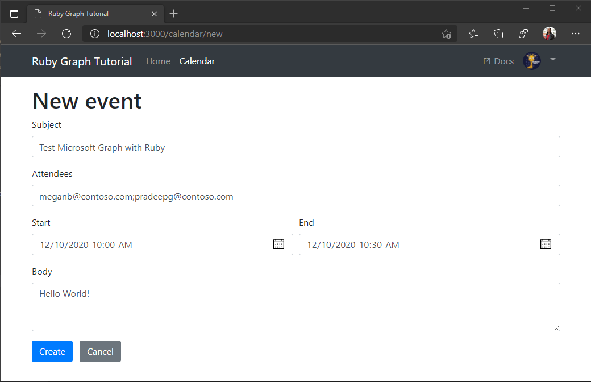

<!-- markdownlint-disable MD002 MD041 -->

<span data-ttu-id="e4780-101">En esta sección, agregará la capacidad de crear eventos en el calendario del usuario.</span><span class="sxs-lookup"><span data-stu-id="e4780-101">In this section you will add the ability to create events on the user's calendar.</span></span>

1. <span data-ttu-id="e4780-102">Abra **./app/helpers/graph_helper. RB** y agregue el siguiente método a la clase **Graph** .</span><span class="sxs-lookup"><span data-stu-id="e4780-102">Open **./app/helpers/graph_helper.rb** and add the following method to the **Graph** class.</span></span>

    :::code language="ruby" source="../demo/graph-tutorial/app/helpers/graph_helper.rb" id="CreateEventSnippet":::

1. <span data-ttu-id="e4780-103">Abra el **calendar_controller./app/Controllers/** y agregue la siguiente ruta a la clase **CalendarController**</span><span class="sxs-lookup"><span data-stu-id="e4780-103">Open **./app/controllers/calendar_controller** and add the following route to the **CalendarController** class.</span></span>

    :::code language="ruby" source="../demo/graph-tutorial/app/controllers/calendar_controller.rb" id="CreateEventRouteSnippet":::

1. <span data-ttu-id="e4780-104">Abra **./config/Routes.RB** y agregue la nueva ruta.</span><span class="sxs-lookup"><span data-stu-id="e4780-104">Open **./config/routes.rb** and add the new route.</span></span>

    ```ruby
    post 'calendar/new', :to => 'calendar#create'
    ```

1. <span data-ttu-id="e4780-105">Abra **./app/views/calendar/new.html. Erb** y reemplace su contenido por lo siguiente.</span><span class="sxs-lookup"><span data-stu-id="e4780-105">Open **./app/views/calendar/new.html.erb** and replace its contents with the following.</span></span>

    :::code language="html" source="../demo/graph-tutorial/app/views/calendar/new.html.erb" id="NewEventFormSnippet":::

1. <span data-ttu-id="e4780-106">Guarde los cambios y actualice la aplicación.</span><span class="sxs-lookup"><span data-stu-id="e4780-106">Save your changes and refresh the app.</span></span> <span data-ttu-id="e4780-107">En la página **calendario** , seleccione el botón **nuevo evento** .</span><span class="sxs-lookup"><span data-stu-id="e4780-107">On the **Calendar** page, select the **New event** button.</span></span> <span data-ttu-id="e4780-108">Rellene el formulario y seleccione **crear** para crear un nuevo evento.</span><span class="sxs-lookup"><span data-stu-id="e4780-108">Fill in the form and select **Create** to create a new event.</span></span>

    
